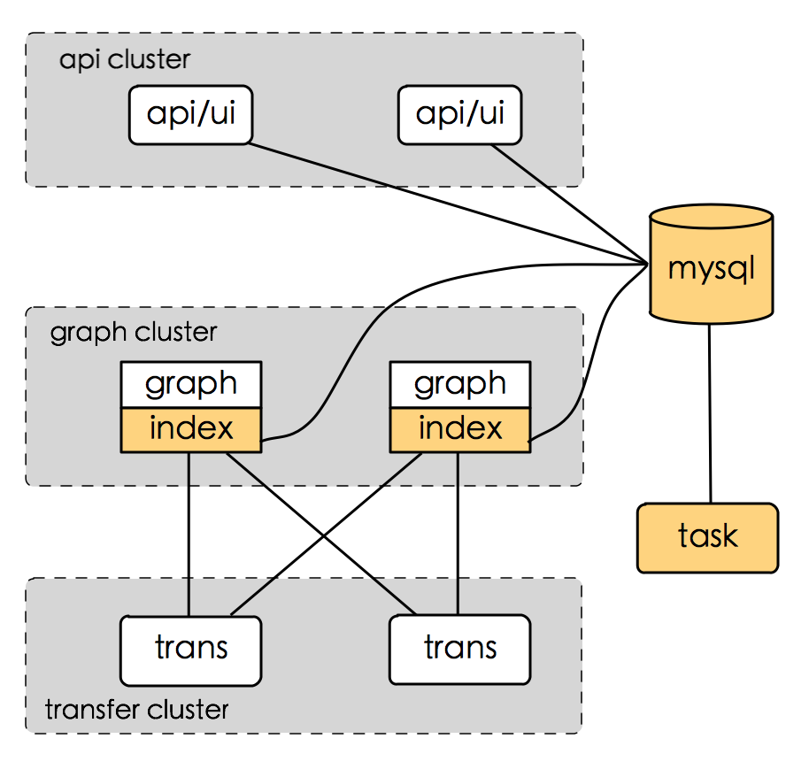
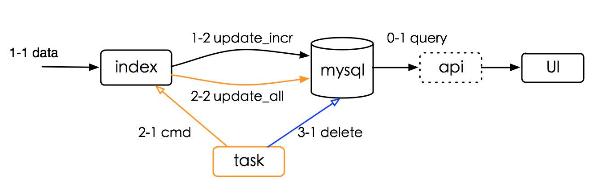
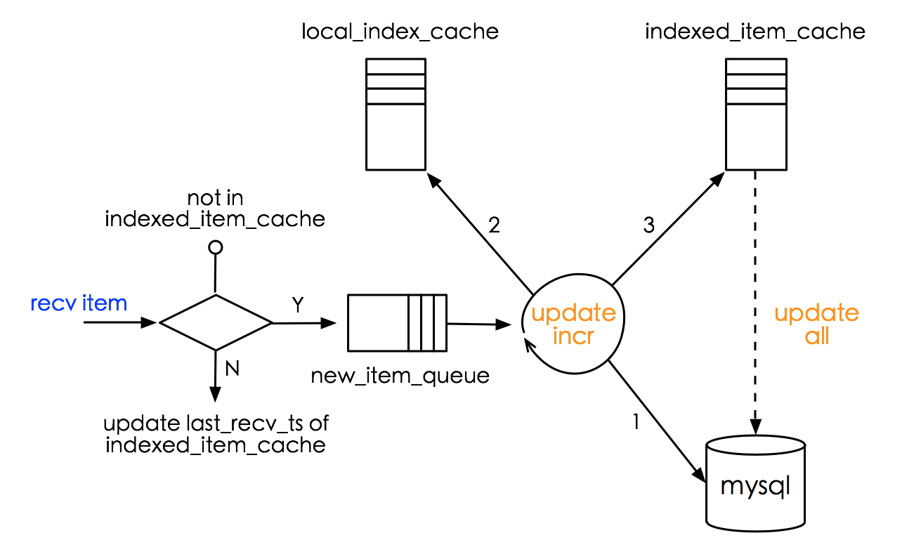

Date: 2015-04-09  
Title: index design  
Author: Anddy Nie  
Email: <nieanan@xiaomi.com>   
Origin: [tycloudstart](http://tycloudstart.com/xiaomi/index-design/index-design.html) 

# index设计文档

## 概述
索引部分，关注的是索引更新（新建，清除）和索引使用。 1.索引更新。根据实时上报的监控数据，新建索引；如果某监控数据已经很长时间不上报了，清除对应的索引。2.索引使用。主要被用于UI等的查询操作。

## 业务需求

### 功能要求

> **endpoint搜索**

1. 根据endpoint的部分拼写,搜索到对应的endpoint(s)
2. 根据tag(s),搜索到对应的endpoint(s)

> **counters搜索**

3. 根据endpoint,搜索到对应的counter(s)

**总结: 可以预见的将来，业务需求都是关系型搜索**

### 性能要求
> **实时性**

1. 新上报的监控数据，能够较快生成对应的索引、用于查询该监控数据。新建索引的过程，越快越好。

> **一致性**

1. 已失效的索引数据，要在一段时间内清除，防止对用户造成干扰。多长时间没有更新的索引 才能算是垃圾，这个要同业务讨论；清理索引 并不是越实时越好。

### 需求取舍
这里，姑且做这样的定义。

1. 新增索引，能够在10min内被搜索到。用户最迟10min后，就能索引到它关注的数据。
2. 过期索引，1d清除一次。垃圾数据，做多影响用户24h；上报周期大于24h的监控数据，惨喽

## 系统选型

### 基于Mysql
##### 实现方式
* 将关系查询的功能，交给mysql实现（合理设计表的索引）
* 程序负责更新mysql中的索引数据，并**尽量较少 由索引更新引起的 mysql读写**

	增量更新，满足实时性的要求。全量更新，频率可控，要发生在垃圾清理之前。垃圾清理，依赖最后更新时间，保证过期索引被及时的干掉。全量更新和垃圾清理，可以用一个cron来控制进行。
* 要做好手动控制接口，用于手动触发增量更新、垃圾清理。我们现在还不能消灭人肉，但可以较少人肉的工作量。
* 本次的设计容量为2亿（counter_endpoint），是当前数据量的**2/0.3=6.7**倍。目测，撑一年没问题。
* 将来要考虑：mysql的读写分离、分库分表。

##### 优点
* 使用mysql带来的好处: 将读交给mysql去做了，简单、可信赖；索引就在数据库中存着，debug和排错时很方便

##### 缺点
* 要控制程序对mysql的读写并发，防止把mysql搞死
* 数据在mysql和本地各有一份，如何保持数据的一致性是个问题

### 基于自建缓存
##### 实现方式
* 数据分片处理
* 在本地进行数据的实时更新和垃圾清理
* 对外提供供查询的接口，同时需要一个index_proxy

##### 优点
* 高并发的问题，可以通过增加分片、优化程序解决
* 索引数据只有一份，不存在一致性问题

##### 缺点
* 需要自己实现关系型查询（数据结构和接口等）
* 查询过程变复杂（index是一个集群、索引数据分片后不利于集中查询）
* debug和排错，将变得复杂

### 系统选型
选择“基于mysql”的方案。原因：

1. 成熟。mysql组件已经很成熟，风险可控，后续的扩容方案也有迹可循。
2. 简单。很大一部分的工作都由mysql完成了，我们要做的是数据更新。工作量小很多。

## 系统设计
系统设计，从部署架构、业务逻辑、系统运维等方面描述。

### 部署架构
index是独立的功能模块，能够独立、分片部署。但index需要一份完整的数据，为了性能考虑、同时考虑到部署特点，将index与graph混合部署。

	

### 业务逻辑

	

#### 数据流
>消费索引数据，read操作

UI等是最终的索引用户。现在UI直接查数据库，后续可以加一个**api层**，可用于*sql语句管理*、访问控制等。
*看了下现在UI代码中的sql语句，有很多的in操作、like操作等，隐形的雷区，有时间了整理下这里*。

>增量更新，read & add | update 操作

索引增量更新是index模块的一个功能，其处理逻辑+数据流如下图，

	

**local_index_cache**， 索引的本地缓存。 
**new_item_queue**，可能引发索引 增量更新 的监控数据item的缓存。 
**indexed_item_cache**，已经创建了相应索引的监控数据的缓存，主要用于 （1）判断收到的item是否可能引起增量更新、（2）全量更新。监控数据以{endpoint，metric，tags}来区分，同种类型的监控数据 引起的索引增量更新 效果相同。因此，这个缓存里面只记录 一类监控数据的一个实例 & 这类实例的最后上报时间。

| key                 | item      | lastTs |
|---------------------|-----------|--------|
| endpoint/metric/tags| GraphItem | unixTs |

增量更新的过程，描述为：index接收到的监控数据 是索引增量更新的驱动源。首先把可能 引发'增量索引' 的item缓存到new_item_queue；增量更新任务 从new_item_queue中 取出数据，然后将这条数据的信息 依次更新到 持久存储mysq、索引本地缓存local_index_cache、已经建立过索引的item缓存indexed_item_cahce，要严格按照此顺序进行更新、否则可能会产生数据的不一致。

如何判断item可能引发'增量索引'？在indexed_item_cache中，存放了{endpoint, metric, tags}为key的监控数据。一旦某个监控数据被用于更新mysql中的索引、并且成功了，我们就把这个item的信息放到indexed_item_cache中。这样，下一次上报的 同类型(即{endpoint,metric,tags}组成的key是一样的) item 就不会再被用于'增量更新'。我们这里做了'宁滥勿缺'的逻辑，因为 没有被放到indexed_item_cache的item 可能已经生成了对应的索引，这种情况发生在index重启、index扩容等 时候。

**
在index重启、index扩容时，indexed_item_cache命中率 很低或为零，这时一定会对mysql造成较大的读压力。这种压力到底有多大，待测试。后续可以将indexed_item_cache的内容在本地存成文件、初始化时重新加载进来，略复杂、排期搞。
**

>全量更新，read & add & update操作

索引全量更新是index模块的一个功能。经过增量更新，index上最终会有一份完整的索引缓存(因为监控数据一直在上报)。全量更新时，将这份完整的索引缓存 更新到 mysql中，只做add和update操作、不做delete操作。 
**风险：**全量更新时 如果index上的索引缓存还没有完整的建立好，那么 遗漏的索引 将不能更新t_modify时间，可能会被垃圾清理任务干掉。 
**问题：**如何保障索引的完整性，如何防止并行全量同步。

>垃圾清理，delete操作（&select操作）

垃圾清理 是在帮忙搞定过期index的清理，是可以独立部署的任务模块。根据时间戳，删除掉**1d内**没有被更新的索引。原则上是简单地delete操作即可，但为了debug及delete控制，可能要有删除记录（这就需要先select、然后控制+操作记录、最后一条条的delete）

**TODO:** 把一些周期性的、不与其他子系统耦合的功能，整理到一个叫做task的模块中。task模块是falcon系统的一个大杂烩场所。

#### 配置流
task需要知道index的分片信息。因为index与graph混合部署，所以task要有一份与graph一致的分片列表。这一块增加了运维成本。

### 系统运维
> 运维接口

* 查看graph单机上 已经缓存的index信息，用于验证index是否生成。
* 所有cache的常规统计信息
* index收到的监控数据的统计接口，用于验证 index是否收到了某个item。

## 注意事项
done 
1. 集群扩容时，索引更新是否有高并发 
2. index独立部署，还是要搭graph的顺风车

## 大家的问题
mysql压力过重，原因在哪里？ 
mysql，编码报错，解决下？ 
mysql索引的建立，长度限制，tags会有长度限制。 
增量更新，缓存是否必要？ 